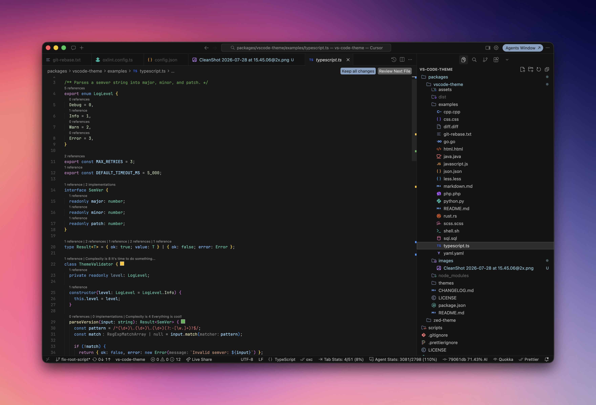
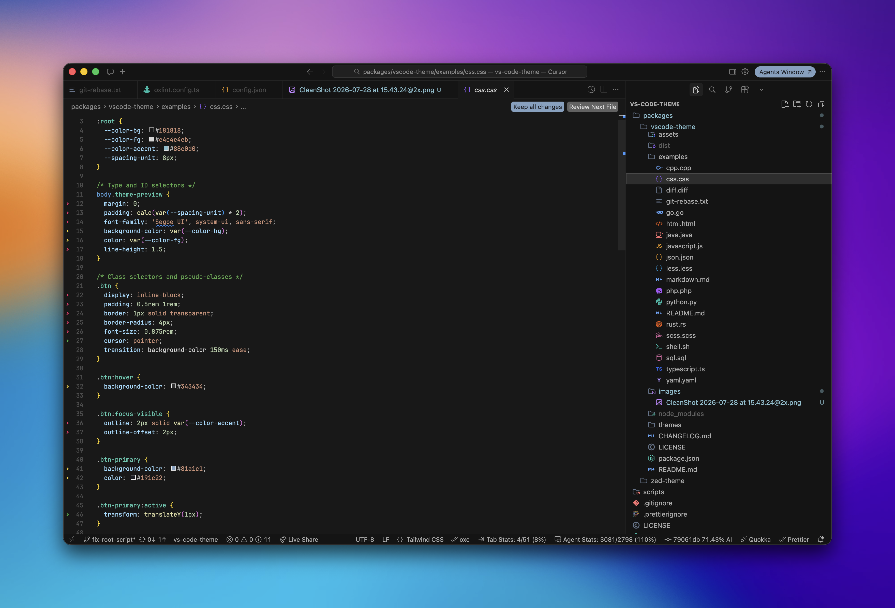
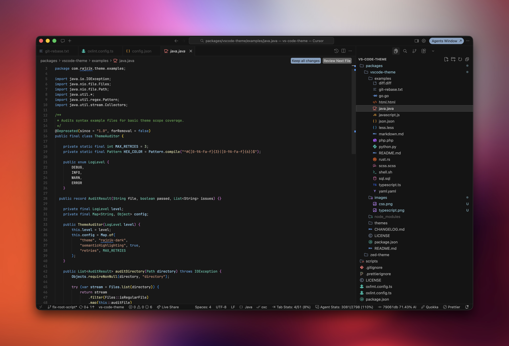

# Rajzik VS Code Theme

A dark editor theme with a calm charcoal surface, soft foreground contrast, and cool blue accents.

## Showcase

| TypeScript                                                   | CSS                                            | Java                                             |
| ------------------------------------------------------------ | ---------------------------------------------- | ------------------------------------------------ |
|  |  |  |

This repository uses `pnpm` workspaces and Turborepo to manage the editor theme packages in:

- `packages/vscode-theme` for Visual Studio Code
- `packages/zed-theme` for Zed

## Commands

```sh
pnpm install
pnpm format
pnpm generate:zed-theme
pnpm package
pnpm changeset
```

## Release flow

Changesets opens a release pull request from changeset files merged into `main`. When that release is merged, GitHub creates a release and a separate workflow publishes the extension to the Visual Studio Code Marketplace.

## Zed theme generation

The Zed theme is generated from the VS Code theme source:

```sh
pnpm generate:zed-theme
```

This writes `packages/zed-theme/themes/rajzik.json`. To test it locally in Zed, install `packages/zed-theme` as a dev extension as described in the [Zed extension docs](https://zed.dev/docs/extensions/developing-extensions).
